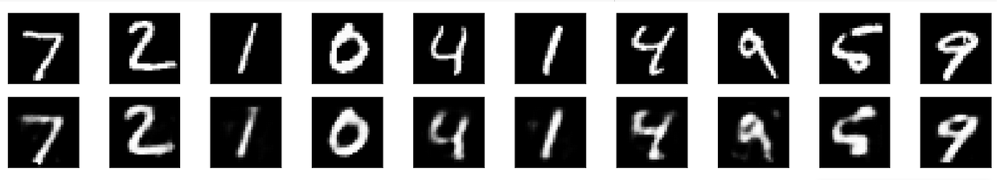
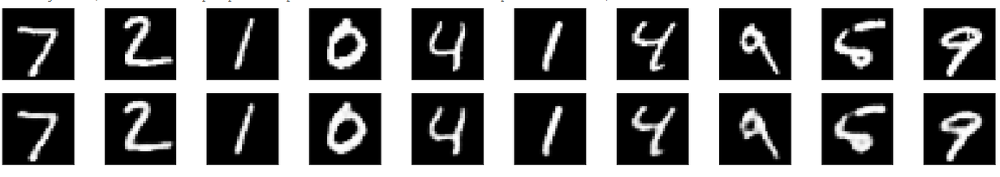

# Autoencoders
Autoencoders are neural networks used for data compression, image de-noising, and dimensionality reduction. Building autoencoders using PyTorch.

## Simple Autoencoder
> Real images on top, generated at the bottom

## Convolutional Autoencoder
> Real images on top, generated at the bottom

Using interpolations inplace of transpose convolutions

